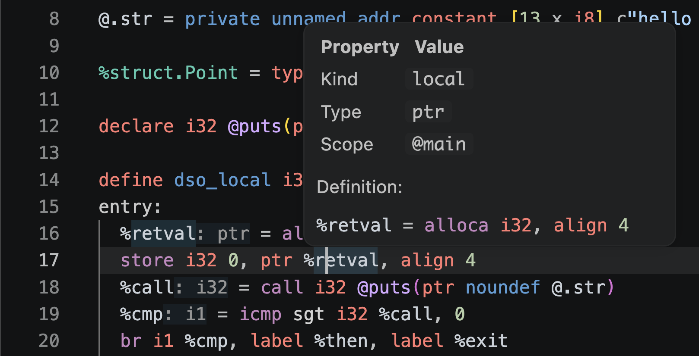
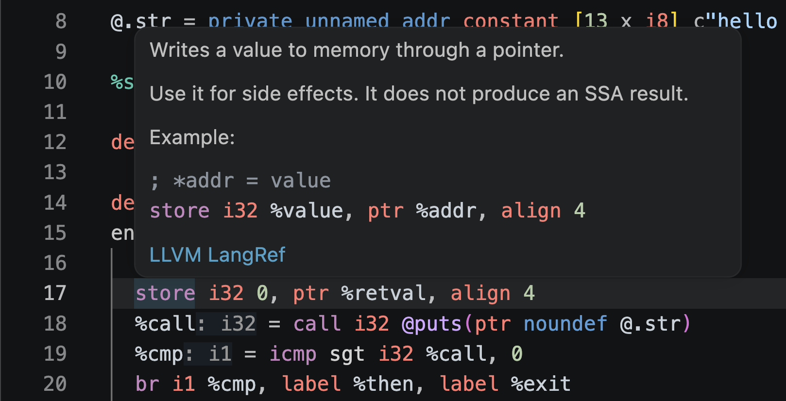

# llvm-analyzer

An LSP for LLVM IR (`.ll`) files.

| Definition Jump & View               | Document Preview            |
| ------------------------------------ | --------------------------- |
|  |  |

## Features

| Category       | Feature                                                                                                                |
| -------------- | ---------------------------------------------------------------------------------------------------------------------- |
| Display        | Syntax highlighting, Semantic Tokens, Folding Range                                                                    |
| Navigation     | Declarative hover, opcode, type, attribute hover, go to definition, find references, Document Symbol, Workspace Symbol |
| Editing        | Completion, Rename, Format, Range Format                                                                               |
| Diagnostics    | Parser diagnostics, analyzer diagnostics, external LLVM verifier diagnostics                                           |
| Inlay Hints    | Shows inferred types for SSA values                                                                                    |
| File Links     | Document Link to open real files from `source_filename` and `!DIFile`                                                  |
| Call Hierarchy | Traces direct calls via `call`, `invoke`, and `callbr`                                                                 |
| Control Flow   | Command to display the current function's Control Flow Graph as Mermaid                                                |
| Quick Fix      | Replace with nearby undefined global/label names, delete instructions after terminators                                |

## Coverage

`llvm-analyzer` treats opaque pointer `ptr` as the standard.
Older typed pointer notation is also parsed leniently.

Type syntax covers scalar, pointer, vector, array, struct, function type, named type, and opaque struct.
`ptrtoaddr`, byte type `bN`, debug record, comdat, use-list order, and `ptr addrspace(N)` arguments are also analyzed.

Diagnostics are limited to lightweight structural analysis and name resolution that work during editing.
Undefined references, duplicate definitions, self-references within the same instruction, and normal instructions after terminators are detected.
Type checking dependent on target datalayout and full verification equivalent to the LLVM verifier are not covered.

## LLVM Verifier Integration

External verifier diagnostics use `llvm-as` found on PATH.
The default command is:

```sh
llvm-as -o {devNull} -
```

If `llvm-as` is not available, only external verifier diagnostics are suppressed.
Parser diagnostics and analyzer diagnostics continue to work.

You can replace the verifier command with something like `opt -passes=verify -disable-output -` by changing `llvm-analyzer.verifier.command` and `llvm-analyzer.verifier.args`.

## Configuration

| Setting                                       | Description                                                 |
| --------------------------------------------- | ----------------------------------------------------------- |
| `llvm-analyzer.verifier.enabled`              | Enable external verifier integration.                       |
| `llvm-analyzer.verifier.command`              | Command to run as the verifier.                             |
| `llvm-analyzer.verifier.args`                 | Arguments to pass to the verifier command.                  |
| `llvm-analyzer.verifier.debounceMs`           | Wait time before starting the verifier after editing stops. |
| `llvm-analyzer.verifier.timeoutMs`            | Time before the verifier execution is killed.               |
| `llvm-analyzer.verifier.maxFileBytes`         | Maximum file size for automatic verifier execution.         |
| `llvm-analyzer.diagnostics.parser.enabled`    | Enable parser-based syntax diagnostics.                     |
| `llvm-analyzer.diagnostics.parser.severity`   | Severity of parser-based syntax diagnostics.                |
| `llvm-analyzer.diagnostics.analyzer.enabled`  | Enable analyzer-based semantic diagnostics.                 |
| `llvm-analyzer.diagnostics.analyzer.severity` | Severity of analyzer-based semantic diagnostics.            |
| `llvm-analyzer.diagnostics.verifier.enabled`  | Enable external verifier diagnostics.                       |
| `llvm-analyzer.diagnostics.verifier.severity` | Severity of external verifier diagnostics.                  |
| `llvm-analyzer.inlayHints.types.enabled`      | Show inferred type Inlay Hints for SSA values.              |

## License

This repository is published under the [MIT License](LICENSE).

For developer information, see [docs/development.md](docs/development.md).
