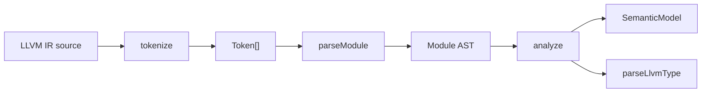

# 解析の流れ

`llvm-analyzer` の解析は `source -> tokens -> AST -> semantic model` の順に進みます。
`parser` は構文を拾い、`analyzer` は識別子同士を結びます。
LSP 形式への変換、外部コマンド実行、配布処理はこの文書の対象外です。

## 全体像



| 段階     | 入力                | 出力                | 主な処理                                                  |
| -------- | ------------------- | ------------------- | --------------------------------------------------------- |
| 字句解析 | LLVM IR 文字列      | `Token[]`           | 文字列を種別付き token に分ける。                         |
| 構文解析 | `Token[]`           | `Module` と構文診断 | トップレベル構造、関数、基本ブロック、命令を AST 化する。 |
| 意味解析 | `Module` と元ソース | `SemanticModel`     | スコープ、シンボル、参照、型、CFG、直接呼び出しを作る。   |

すべての位置は 0 始まりです。
`range` は `offset`、`line`、`column` を持ち、元ソース上の半開区間を指します。

## 字句解析

`tokenize(source)` は空白を読み飛ばし、コメント、識別子、型、命令、定数、数値、文字列、記号を token にします。
末尾には必ずゼロ幅の `Eof` を追加します。
認識できない文字は `Unknown` として残し、後続の解析を止めません。

例として、次の 1 行を字句解析します。

```llvm
  %sum = add i32 %x, 1
```

主な token は次の列になります。

| value  | kind              |
| ------ | ----------------- |
| `%sum` | `LocalIdentifier` |
| `=`    | `Punctuation`     |
| `add`  | `Opcode`          |
| `i32`  | `Type`            |
| `%x`   | `LocalIdentifier` |
| `,`    | `Punctuation`     |
| `1`    | `Number`          |
| ``     | `Eof`             |

バーワードは `classifyBareword` で分類します。
`define` や `declare` は `Keyword`、`add` や `ret` は `Opcode`、`i32` や `ptr` は `Type` になります。

## 構文解析

`parseModule(source)` は `tokenize(source)` の結果からコメントを除き、トップレベルエントリを順に作ります。
`define` は関数本体の `{ ... }` を 1 つの単位として読みます。
それ以外のトップレベルエントリは、括弧や角括弧が閉じる位置までを 1 要素として読みます。

| 入力パターン                 | AST ノード                 |
| ---------------------------- | -------------------------- |
| `source_filename = "..."`    | `SourceFilename`           |
| `%T = type ...`              | `TypeDefinition`           |
| `@g = global ...`            | `GlobalVariable`           |
| `declare ... @f(...)`        | `FunctionDeclaration`      |
| `define ... @f(...) { ... }` | `FunctionDefinition`       |
| `attributes #0 = { ... }`    | `AttributeGroupDefinition` |
| `!0 = !{...}`                | `MetadataDefinition`       |
| `$name = comdat ...`         | `ComdatDefinition`         |

関数本体は `BasicBlock` に分かれます。
ラベル定義で新しい block を開始します。
ラベルのない先頭命令列は暗黙の最初の block になります。

命令は粗く表現します。
`Instruction` は結果名、opcode、命令内に出現した識別子参照を持ちます。
命令内部の型や operand 構造は、この段階では専用ノードに分解しません。

## 識別子参照の収集

parser は名前の出現を `IdentifierRef` として収集します。
`IdentifierRef` は「どの名前がどこに現れたか」だけを表します。
「何を指すか」は analyzer が決めます。

| 構文                        | `IdentifierRef.kind` |
| --------------------------- | -------------------- |
| `@main`                     | `GlobalRef`          |
| `%x`                        | `LocalRef`           |
| `!0`                        | `MetadataRef`        |
| `#0`                        | `AttributeGroupRef`  |
| `$comdat`                   | `ComdatRef`          |
| `br label %exit` の `%exit` | `LabelRef`           |

`phi ... [value, %label]` と `blockaddress(@f, %label)` の `%label` も `LabelRef` として扱います。
`!dbg !0` の `!dbg` のような attachment key は参照から外し、直後の `!0` だけを参照にします。

## 意味解析

`analyze(ast, { source })` は AST から `SemanticModel` を作ります。
処理は定義登録、関数スコープ構築、参照解決、公開モデル作成の順に進みます。

| 順序 | 処理                   | 内容                                                                   |
| ---- | ---------------------- | ---------------------------------------------------------------------- |
| 1    | モジュールスコープ登録 | トップレベルの `defines` を `module` スコープへ登録する。              |
| 2    | 関数スコープ作成       | 関数ごとに引数、ラベル、命令結果を登録する。                           |
| 3    | 派生情報抽出           | 関数本体から直接呼び出しと CFG を抽出する。                            |
| 4    | 参照解決               | `IdentifierRef` を現在のスコープのシンボルへ結びつける。               |
| 5    | 診断蓄積               | 重複定義、未定義参照、同一命令内自己参照、終端命令後の命令を記録する。 |
| 6    | モデル作成             | 参照列をソース順に並べ、不変の `SemanticModel` として返す。            |

関数本体では関数スコープを優先します。
ただし型位置の `%T` は、同名のローカル値よりモジュールスコープの名前付き型を優先します。
ラベル参照は `%exit` から `exit` へ正規化して関数スコープを引きます。

## 型推定

analyzer は hover と inlay hint のために軽量な型推定を行います。
型推定には `parseModule` に渡したものと同じ元ソースが必要です。
命令結果の型は意味モデルの構築時には計算せず、`SemanticSymbol.type`が最初に参照されたときに一度だけ計算します。
Inlay Hintsは要求範囲でシンボルを絞ってから型を参照するため、画面外の命令結果を先回りして推定しません。

| 対象                        | 処理                                                      |
| --------------------------- | --------------------------------------------------------- |
| 関数引数                    | 識別子の直前にある型構文を読む。                          |
| 通常命令の結果              | opcode 直後の型構文を読む。                               |
| 変換命令                    | `to` の後ろの型を結果型にする。                           |
| `icmp` と `fcmp`            | スカラーなら `i1`、ベクトルなら lane ごとの `i1` にする。 |
| `alloca` と `getelementptr` | 結果型を `ptr` にする。                                   |

型文字列は `parseLlvmType` で読み、`formatLlvmType` で表示用に戻します。
読めない場合は `undefined` のままにします。

## 直接呼び出しと CFG

直接呼び出しは `call`、`invoke`、`callbr` から抽出します。
呼び出し先は `@callee(` の形で直接書かれた関数だけです。
関数ポインタ経由の呼び出しは解決しません。

CFG は関数単位で作ります。
block は `BasicBlock` から作り、辺は終端命令中の `label %bb` から作ります。
対象 opcode は `br`、`switch`、`indirectbr`、`invoke`、`callbr` です。
存在する block label へ向かう辺だけを採用します。

## ファイル参照候補

`collectFileReferenceCandidates(ast, source)` は AST と元ソースからファイル参照候補を作ります。
対象は `source_filename` と `!DIFile(filename:, directory:)` だけです。
存在確認や URI 解決は行わず、IR 内に書かれた path と文字列範囲だけを返します。

| 入力                                             | 候補          |
| ------------------------------------------------ | ------------- |
| `source_filename = "main.c"`                     | `main.c`      |
| `!DIFile(filename: "main.c", directory: "/src")` | `/src/main.c` |

## 具体例

次の入力を解析します。

```llvm
@g = global i32 1
define i32 @main(i32 %x) {
entry:
  %sum = add i32 %x, 1
  br label %exit
exit:
  ret i32 %sum
}
```

parser はトップレベルに `GlobalVariable` と `FunctionDefinition` を作ります。
関数定義の中には `entry` と `exit` の 2 つの block ができます。
`%sum = add i32 %x, 1` は、結果 `%sum`、opcode `add`、operand `%x` を持つ `Instruction` になります。

analyzer は主に次のシンボルを作ります。

| name    | kind        | scope    | type    |
| ------- | ----------- | -------- | ------- |
| `@g`    | `global`    | `module` |         |
| `@main` | `function`  | `module` |         |
| `%x`    | `parameter` | `@main`  | `i32`   |
| `entry` | `label`     | `@main`  | `label` |
| `%sum`  | `local`     | `@main`  | `i32`   |
| `exit`  | `label`     | `@main`  | `label` |

参照解決後、`ret i32 %sum` の `%sum` は命令結果 `%sum` のシンボルへ結びつきます。
`br label %exit` の `%exit` は、ラベル定義 `exit:` のシンボルへ結びつきます。

`SemanticModel` は次の問い合わせに答えます。

| 問い合わせ               | 返すもの                                 |
| ------------------------ | ---------------------------------------- |
| `symbolAt(position)`     | 位置上の識別子に対応するシンボル。       |
| `definitionAt(position)` | 位置上の識別子の定義シンボル。           |
| `referencesOf(symbolId)` | 定義位置を含む全参照。                   |
| `documentSymbols()`      | トップレベル定義と関数内シンボルの階層。 |
| `directCalls()`          | 直接呼び出しの caller と callee。        |
| `controlFlowGraphs()`    | 関数単位の block と edge。               |
| `diagnostics()`          | 解析中に蓄積した意味診断。               |
