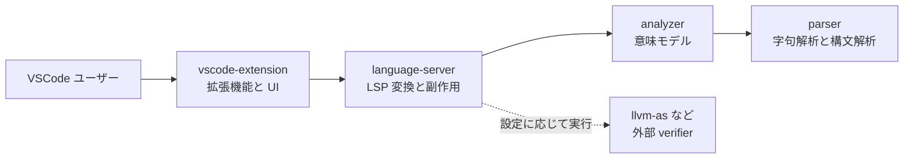
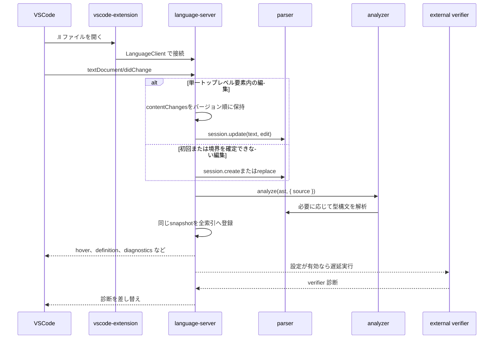

# アーキテクチャ

この文書は、`llvm-analyzer` の現在のリポジトリ構成と処理の流れを短く示します。
詳細な設計意図は [docs/design.md](design.md)、解析の流れは [docs/analysis-flow.md](analysis-flow.md)、language-server の処理は [docs/language-server.md](language-server.md)、開発手順は [docs/development.md](development.md) を参照します。

## 全体像

`llvm-analyzer` は pnpm workspace のモノレポです。
LLVM IR の解析は VSCode や LSP に依存しない純粋な層に置き、エディタ連携と外部コマンド実行はアダプタ層に閉じ込めます。



依存方向は `vscode-extension -> language-server -> analyzer -> parser` です。
`parser` と `analyzer` は VSCode API に依存しません。

## パッケージ構成

| パッケージ                  | 役割                                                                                                  | 主な入口                                              |
| --------------------------- | ----------------------------------------------------------------------------------------------------- | ----------------------------------------------------- |
| `packages/parser`           | LLVM IR を `source -> tokens -> AST` に変換する。型構文と formatter も持つ。                          | `parseModule`、`IncrementalParserSession`、`tokenize` |
| `packages/analyzer`         | AST から意味モデルを構築する。定義、参照、型推定、診断、CFG、ドキュメント辞書を扱う。                 | `analyze`、`formatControlFlowGraphAsMermaid`          |
| `packages/language-server`  | parser と analyzer の結果を LSP 機能へ変換する。設定、診断、workspace index、外部 verifier を扱う。   | `src/server.ts`                                       |
| `packages/vscode-extension` | VSCode 拡張機能として language server を起動する。TextMate 文法、設定、CFG 表示コマンド、E2E を持つ。 | `src/extension.ts`                                    |

## ディレクトリの見取り図

```text
.
├── packages/
│   ├── parser/             # 純粋な lexer、parser、型 parser、formatter
│   ├── analyzer/           # 純粋な意味解析、CFG、hover 用ドキュメント辞書
│   ├── language-server/    # LSP アダプタ、診断設定、verifier、workspace index
│   └── vscode-extension/   # VSCode 拡張機能、文法、設定、E2E fixture
├── docs/
│   ├── adr/                # 採用した設計判断
│   ├── plans/              # 実装フェーズごとの記録
│   ├── analysis-flow.md    # parser と analyzer の処理
│   ├── design.md           # 詳細設計
│   ├── language-server.md  # LSP サーバの処理
│   ├── development.md      # 開発と検証の手順
│   └── roadmap.md          # 実装済み項目と残タスク
├── assets/                 # README 用画像
├── scripts/                # リリース補助スクリプト
└── package.json            # workspace 共通コマンド
```

## 実行時のデータフロー

編集時の主要経路は、ドキュメントのスナップショットを作って純粋層へ渡し、結果だけを LSP 形式へ変換する形です。



`language-server` は変更を debounce し、その間の`contentChanges`を通知順に保持します。
通常の関数内編集では、明示的な編集範囲から対象要素を二分探索し、変更されたトップレベル要素だけを再パースします。
意味モデルはモジュール全体を再リンクし、トップレベル定義をまたぐ参照の整合性を保ちます。
表示用の命令結果型は最初の参照時に一度だけ推定し、Inlay Hintsは要求範囲外の型を評価しません。
構造境界を確定できない変更は全体パースへ戻ります。
parser sessionは直前の更新戦略と再パースbyte数を公開し、性能ベンチマークから局所更新を確認できます。
外部 verifier の結果は、編集中のスナップショットと一致する場合だけ採用します。

## 機能の配置

| 機能                             | 主な配置                                                                           | 備考                                                            |
| -------------------------------- | ---------------------------------------------------------------------------------- | --------------------------------------------------------------- |
| 字句解析、構文解析               | `packages/parser/src/lexer`、`packages/parser/src/parser`                          | エラー回復し、診断を返す。                                      |
| 型構文解析                       | `packages/parser/src/type`                                                         | 表示用の型構造を扱う。                                          |
| フォーマット                     | `packages/parser/src/formatter`                                                    | 行単位の安定した整形を行う。                                    |
| 定義、参照、rename               | `packages/analyzer/src/semantic` と `packages/language-server/src/lsp/features.ts` | analyzer が索引を持ち、language-server が LSP edit に変換する。 |
| hover、completion                | `packages/analyzer/src/semantic/docs` と LSP feature 変換                          | opcode、type、attribute の説明辞書を再利用する。                |
| 診断                             | parser、analyzer、external verifier                                                | language-server で設定と severity を適用する。                  |
| Workspace Symbol、Call Hierarchy | `packages/language-server/src/lsp/workspace-symbols.ts`、`call-hierarchy.ts`       | `.ll` ファイルの解析結果を索引化する。                          |
| CFG 表示                         | analyzer と vscode-extension                                                       | analyzer が Mermaid を作り、拡張機能が Markdown として開く。    |
| Document Link                    | analyzer と language-server                                                        | 候補抽出と実ファイル解決を分ける。                              |

## 境界と副作用

| 層                 | 許可すること                                              | 避けること                                   |
| ------------------ | --------------------------------------------------------- | -------------------------------------------- |
| `parser`           | 文字列入力から token、AST、診断、整形結果を返す。         | VSCode API、ファイル I/O、外部コマンド実行。 |
| `analyzer`         | AST と source から意味モデルを返す。                      | workspace の実在確認、LSP 型への直接依存。   |
| `language-server`  | LSP 変換、設定取得、workspace index、外部 verifier 実行。 | 解析規則を副作用込みで実装すること。         |
| `vscode-extension` | LanguageClient 起動、VSCode command、配布設定。           | parser や analyzer の規則を複製すること。    |

この分離により、LLVM IR 固有の判断は純粋層でテストし、エディタ依存の挙動はアダプタ層で確認できます。

## テストと検証

| コマンド                                      | 確認する内容                                  |
| --------------------------------------------- | --------------------------------------------- |
| `pnpm lint`                                   | TypeScript の静的 lint。                      |
| `pnpm format`                                 | oxfmt による整形チェック。                    |
| `pnpm typecheck`                              | 各 workspace package の型検査。               |
| `pnpm test`                                   | parser、analyzer、language-server の Vitest。 |
| `pnpm test:coverage`                          | Vitest とカバレッジ計測。                     |
| `pnpm benchmark:large-ir -- --check`          | 初回解析と差分編集後の性能回帰検査。          |
| `pnpm build`                                  | workspace 全体の build。                      |
| `pnpm --filter llvm-analyzer-vscode test:e2e` | VSCode Extension Host 経由の E2E。            |

通常の変更では、影響範囲に応じて `pnpm test`、`pnpm typecheck`、`pnpm build` を組み合わせます。
拡張機能の起動経路や VSCode 固有機能を変えた場合は E2E も実行します。
