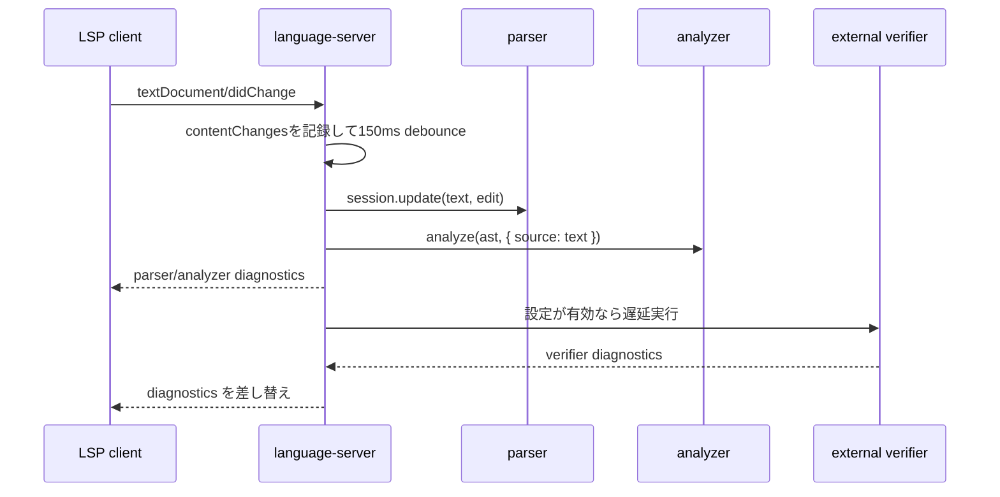

# language-server の処理

`language-server` は LSP クライアントと純粋解析層の間にあるアダプタです。
LLVM IR の規則は `parser` と `analyzer` に置き、`language-server` は結果を LSP の形へ変換します。

## 責務

| 対象   | 内容                                                                      |
| ------ | ------------------------------------------------------------------------- |
| 入力   | VSCode から届く LSP request、notification、configuration。                |
| 保持   | URI ごとの解析済み snapshot、workspace symbol 索引、call hierarchy 索引。 |
| 出力   | hover、definition、diagnostics、completion、formatting などの LSP 応答。  |
| 副作用 | 設定取得、workspace 走査、ファイル存在確認、外部 verifier 実行。          |

`language-server` は解析規則を直接持ちません。
解析規則を変える場合は `parser` または `analyzer` を変更します。

## 起動時の処理

| 段階                | 処理                                                            |
| ------------------- | --------------------------------------------------------------- |
| initialize          | クライアント capability と workspace folder URI を受け取る。    |
| initialize response | 対応する LSP capability を宣言する。                            |
| initialized         | workspace folder 配下の `.ll` ファイルを走査する。              |
| 初期索引            | `.git`、`node_modules`、`dist`、`coverage` を除外して解析する。 |

起動時の索引は workspace 全体機能のために作ります。
通常の単一ファイル機能は、要求時点のドキュメント snapshot だけで応答します。

## 変更時の処理



変更通知は 150ms debounce して解析します。
待機中に複数の通知が届いた場合は、開始バージョンと終了バージョンを確認し、`contentChanges`を通知順にparser sessionへ適用します。
バージョンが連続しない場合は推測した変更列を使わず、安全な全文解析へ戻ります。
解析結果は `DocumentSnapshot` として URI ごとに保存します。
保存した snapshot は `uri`、`version`、`text`、`TextDocument`、parser session、parse 結果、semantic model を持ちます。

診断は二段階で送ります。
最初に parser 診断と analyzer 診断を送ります。
次に external verifier の結果を取得し、同じ snapshot に対する結果だけを結合して送ります。

新しい編集が来た場合、古い解析待ち timer と verifier 実行を破棄します。
verifier の実行中プロセスは `AbortController` で中止します。

## snapshot の契約

| 条件                       | 動作                                   |
| -------------------------- | -------------------------------------- |
| 要求時点の snapshot がある | その snapshot を使う。                 |
| snapshot が古い            | 現在の `TextDocument` から作り直す。   |
| ドキュメントが閉じている   | 保持済み snapshot があればそれを使う。 |
| verifier 結果が古い        | publish しない。                       |

snapshot は LSP 応答の基準です。
位置変換、range 変換、シンボル検索、診断変換は snapshot 内の `TextDocument` と semantic model だけを見ます。
snapshot作成時に行位置表と安全な置換候補索引を準備します。
同じsnapshotから導出したDocument Symbols、Semantic Tokens、Folding Ranges、Document Link候補は再利用し、文書バージョンの置換を失効境界にします。

## LSP 機能の対応

| LSP 機能            | 主な入力                                 | 主な出力                      |
| ------------------- | ---------------------------------------- | ----------------------------- |
| hover               | `symbolAt`、ドキュメント辞書             | Markdown hover。              |
| definition          | 定義参照インデックス                     | `Location`。                  |
| references          | 定義参照インデックス                     | `Location[]`。                |
| documentSymbol      | semantic model                           | `DocumentSymbol[]`。          |
| semanticTokens/full | semantic model の参照列                  | delta encoding 済み token。   |
| diagnostics         | parse 診断、semantic 診断、verifier 診断 | `publishDiagnostics`。        |
| completion          | scope 内シンボル、keyword、型辞書        | `CompletionItem[]`。          |
| rename              | 参照列                                   | `WorkspaceEdit`。             |
| foldingRange        | 関数定義 range                           | `FoldingRange[]`。            |
| inlayHint           | SSA 値の推定型                           | 型 hint。                     |
| documentLink        | ファイル参照候補、実在ファイル           | `DocumentLink[]`。            |
| formatting          | `formatLlvmIr`                           | 全体置換 edit。               |
| rangeFormatting     | 現在関数の範囲、選択行の断片             | 選択範囲と交差する行の edit。 |
| codeAction          | stable diagnostic code                   | 安全な quick fix。            |
| CFG command         | 関数範囲索引、独自LSP request            | Mermaidテキスト。             |

単一ドキュメント機能は `packages/language-server/src/lsp/features.ts` に集約します。
workspace 横断機能は専用索引に分けます。

## リクエストとレスポンス例

以下の例では `file:///hello.ll` が次の内容を持つとします。
LSP の `line` と `character` は 0 始まりです。
JSON-RPC の `Content-Length` header は省略します。

```llvm
source_filename = "hello.c"
@g = global i32 1
define i32 @main(i32 %x) {
entry:
  %sum = add i32 %x, 1
  br label %exit
exit:
  ret i32 %sum
}
```

`%sum` に対する hover request です。

```json
{
  "jsonrpc": "2.0",
  "id": 1,
  "method": "textDocument/hover",
  "params": {
    "textDocument": { "uri": "file:///hello.ll" },
    "position": { "line": 4, "character": 4 }
  }
}
```

server は analyzer のシンボル情報を Markdown hover に変換します。

````json
{
  "jsonrpc": "2.0",
  "id": 1,
  "result": {
    "contents": {
      "kind": "markdown",
      "value": "| Property | Value |\n| --- | --- |\n| Kind | `local` |\n| Type | `i32` |\n| Scope | `@main` |\n\nDefinition:\n```llvm\n%sum = add i32 %x, 1\n```"
    },
    "range": {
      "start": { "line": 4, "character": 2 },
      "end": { "line": 4, "character": 6 }
    }
  }
}
````

`ret i32 %sum` の `%sum` に対する definition request です。

```json
{
  "jsonrpc": "2.0",
  "id": 2,
  "method": "textDocument/definition",
  "params": {
    "textDocument": { "uri": "file:///hello.ll" },
    "position": { "line": 7, "character": 11 }
  }
}
```

server は定義位置を `Location` として返します。

```json
{
  "jsonrpc": "2.0",
  "id": 2,
  "result": {
    "uri": "file:///hello.ll",
    "range": {
      "start": { "line": 4, "character": 2 },
      "end": { "line": 4, "character": 6 }
    }
  }
}
```

未定義参照を含む変更通知です。
`textDocument/didChange` は notification なので、request に対する response はありません。

```json
{
  "jsonrpc": "2.0",
  "method": "textDocument/didChange",
  "params": {
    "textDocument": { "uri": "file:///broken.ll", "version": 2 },
    "contentChanges": [
      {
        "text": "define i32 @main() {\n  ret i32 %missing\n}\n"
      }
    ]
  }
}
```

解析後、server は `textDocument/publishDiagnostics` を送ります。

```json
{
  "jsonrpc": "2.0",
  "method": "textDocument/publishDiagnostics",
  "params": {
    "uri": "file:///broken.ll",
    "diagnostics": [
      {
        "range": {
          "start": { "line": 1, "character": 10 },
          "end": { "line": 1, "character": 18 }
        },
        "message": "`%missing` が定義されていません",
        "severity": 1,
        "source": "llvm-analyzer",
        "code": "undefined-reference"
      }
    ]
  }
}
```

## workspace 索引

| 索引                   | 対象                                                                                         | 更新条件                                        |
| ---------------------- | -------------------------------------------------------------------------------------------- | ----------------------------------------------- |
| `WorkspaceSymbolIndex` | モジュールスコープの関数、グローバル、型、メタデータ、属性グループ、comdatの名前三文字索引。 | 起動時走査、open document、watched file event。 |
| `CallHierarchyIndex`   | 直接呼び出しのcaller別索引とcallee別索引。                                                   | 起動時走査、open document、watched file event。 |

open document はディスク上のファイルより優先します。
開いている `.ll` ファイルはエディタ上の内容で索引します。
閉じた `.ll` ファイルはディスク内容へ戻します。
削除された `.ll` ファイルは索引から消します。
3文字以上のWorkspace Symbol queryは三文字索引で候補を絞り、部分一致契約を保ったまま無関係なシンボルを走査しません。
3文字未満のqueryは候補を安全に絞れないため、全シンボルを対象にします。

## 操作性能の契約

| 操作                                              | 計算量                                                                 |
| ------------------------------------------------- | ---------------------------------------------------------------------- |
| Definition、Hover、現在関数のCFG                  | 解決済み出現数または関数数に対して`O(log n)`。                         |
| 表示範囲Inlay Hints                               | 定義境界の探索`O(log n)`と範囲内結果数に比例。                         |
| References、Rename                                | 対象シンボルの参照数に比例し、再整列しない。                           |
| Document Symbols、Semantic Tokens、Folding Ranges | 初回は返却件数に比例し、同じsnapshotの再要求では導出結果を再利用する。 |
| Range Formatting                                  | 選択行数に比例し、文書全体を整形しない。                               |
| Workspace Symbols、Call Hierarchy                 | 登録時に索引化し、問い合わせでは索引候補と返却件数を処理する。         |

初回解析と索引準備を含む操作別の待ち時間は`pnpm benchmark:large-ir -- --check`で検査します。
結果件数が一定の対話操作は20 ms、全件操作の初回生成は100 msを上限にします。

## 設定

| 設定                        | 用途                                                                   |
| --------------------------- | ---------------------------------------------------------------------- |
| `llvm-analyzer.diagnostics` | parser、analyzer、verifier の有効化と severity を決める。              |
| `llvm-analyzer.verifier`    | verifier の command、args、debounce、timeout、最大入力サイズを決める。 |
| `llvm-analyzer.inlayHints`  | 型 inlay hint の表示を決める。                                         |

設定値は cache します。
`workspace/didChangeConfiguration` を受けたら cache を破棄し、開いている全ドキュメントを再解析します。
inlay hint の refresh はクライアントが対応する場合だけ実行します。

## 副作用の扱い

| 副作用                   | 方針                                                                            |
| ------------------------ | ------------------------------------------------------------------------------- |
| 設定取得失敗             | 既定値で処理を続ける。                                                          |
| workspace 走査失敗       | 読めないディレクトリを無視する。                                                |
| verifier command missing | verifier 診断を出さない。                                                       |
| verifier timeout         | ファイル先頭に warning を出す。                                                 |
| verifier abort           | 診断を出さない。                                                                |
| verifier size 超過       | verifier を実行しない。                                                         |
| documentLink 解決        | workspace folder または IR ファイルのディレクトリ配下の実在ファイルだけを返す。 |

副作用の失敗は、可能な限り LSP サーバの処理全体へ波及させません。
純粋解析で出せる応答を維持し、外部環境に依存する結果だけを省略します。

## 変更箇所の目安

| 変更したいこと             | 主な変更先                                                                 |
| -------------------------- | -------------------------------------------------------------------------- |
| LLVM IR の構文を増やす     | `packages/parser`。                                                        |
| シンボル、型、診断を増やす | `packages/analyzer`。                                                      |
| LSP 形式への変換を変える   | `packages/language-server/src/lsp/features.ts`。                           |
| workspace 横断検索を変える | `workspace-symbols.ts` または `call-hierarchy.ts`。                        |
| 外部 verifier を変える     | `verifier.ts` と `server.ts`。                                             |
| VSCode 設定を増やす        | `packages/vscode-extension/package.json` と language-server の設定正規化。 |
